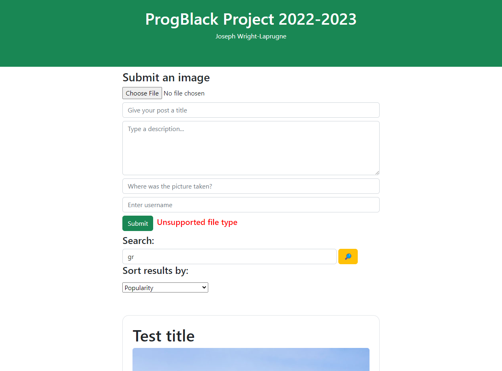
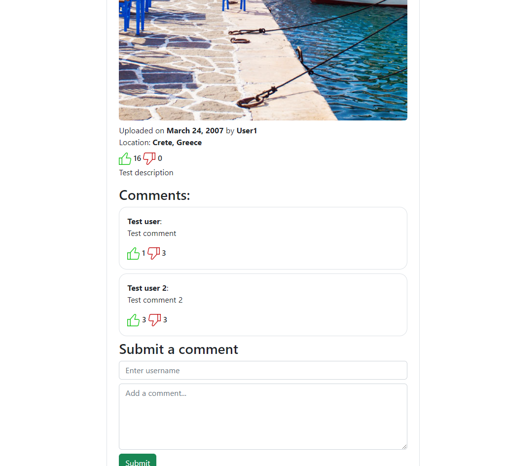

# Programming Black project 2022-2023
Single-page image sharing app using JavaScript and Node.js

## How to use:

- Open command line in project directory
- Run "node server.js"
- Navigate to localhost:3000

## Screenshot 1:

## Screenshot 2:

